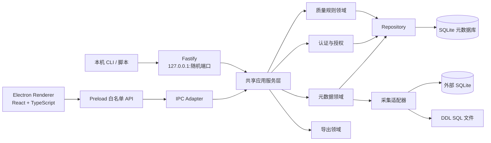
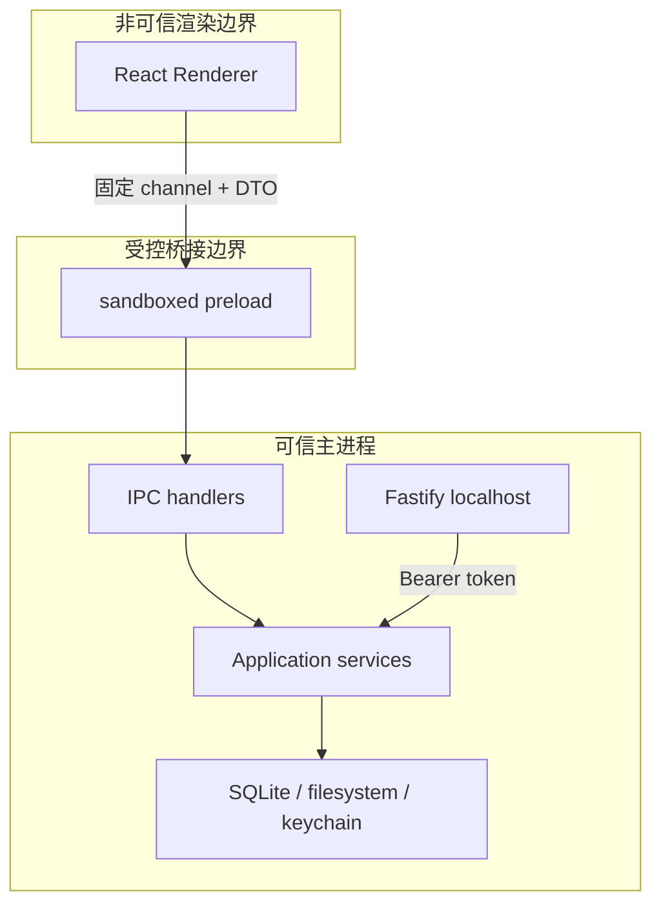
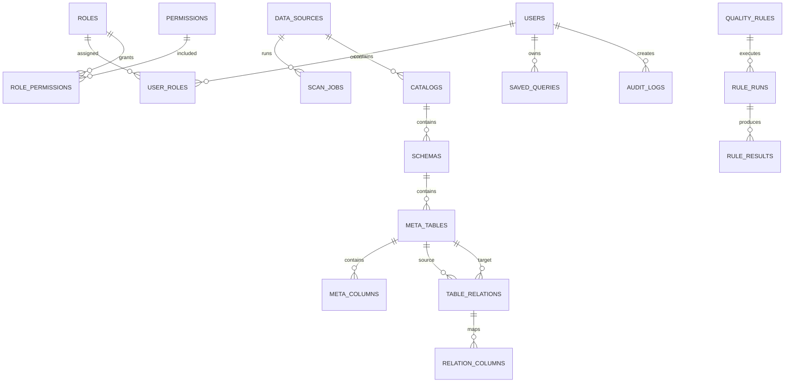
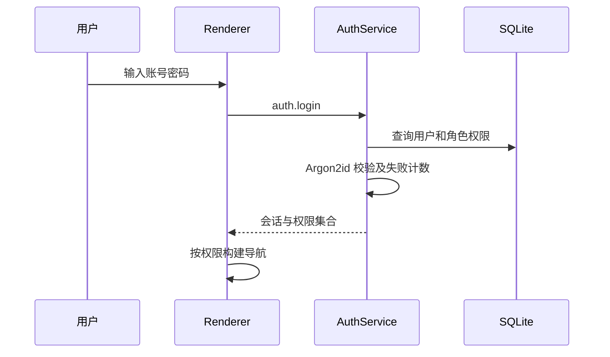
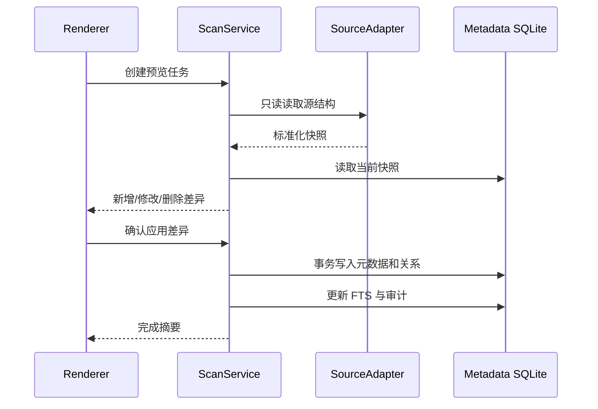

# 元数据管理桌面应用详细设计

> 文档版本：1.0  
> 技术基线：Electron + React + TypeScript + Node.js + SQLite  
> 设计依据：`meta.sql`（87 张表、634 个字段）  
> 标记说明：**SQL 事实**表示可由源文件直接验证；**设计推断**表示依据命名和字段语义推导；**目标态设计**表示新应用采用的方案。

## 1. 项目概述

### 1.1 建设目标

建设一款 Windows、macOS 双平台本地桌面应用，在不依赖中心服务器的情况下完成：

1. 从外部 SQLite 数据库或 DDL SQL 文件采集元数据。
2. 管理表、字段、约束、索引、逻辑关系、标签和备注。
3. 对元数据执行质量检查并形成可追踪的问题报告。
4. 提供跨对象全文检索和可视化关系浏览。
5. 导出可维护的 Markdown 数据字典。
6. 通过本地多用户 RBAC 控制功能访问，并记录关键操作审计。
7. 通过安全 IPC 服务 Electron 页面，通过回环 HTTP API 服务本机自动化工具。

### 1.2 首期范围

| 能力 | 首期 | 说明 |
|---|:---:|---|
| 本地账号、角色、功能权限 | 是 | 首位用户初始化为管理员 |
| SQLite 数据源采集 | 是 | 只读扫描表、视图、列、索引、主外键 |
| DDL SQL 文件导入 | 是 | 支持 UTF-8/GBK、Oracle/达梦风格常见语法 |
| 元数据浏览、维护、搜索 | 是 | 数据源、目录、表、字段、关系、标签 |
| 元数据质量规则 | 是 | 命名、类型、必填、主键、注释、关系完整性 |
| Markdown 数据字典导出 | 是 | 支持范围选择和质量结果 |
| 本机 HTTP 自动化 API | 是 | 仅监听回环地址 |
| 通用规则树执行器 | 否 | 后续版本评估 |
| 复杂行列级数据权限 | 否 | 首期仅做功能权限 |
| 门户、即时通信、业务任务 | 否 | 仅作为旧系统分析材料 |
| 库间/文件/Excel 数据比对 | 否 | 后续适配器扩展 |
| 云同步及局域网访问 | 否 | 单机产品边界 |

### 1.3 用户角色

| 角色 | 主要职责 | 默认权限 |
|---|---|---|
| 系统管理员 | 初始化、用户角色、应用设置、备份恢复 | 全部权限 |
| 元数据管理员 | 数据源、采集、元数据和关系维护 | 除系统管理外的业务权限 |
| 质量管理员 | 规则配置、执行和结果处理 | 规则读写、元数据只读 |
| 查看者 | 搜索、浏览和导出获准数据 | 只读及导出 |

## 2. 旧系统元数据分析

### 2.1 SQL 事实

- 源文件包含 87 张表、634 个字段、85 个主键定义和 5 个唯一约束。
- 源文件没有显式 `FOREIGN KEY`，所有旧表跨表引用均未获得数据库约束保障。
- 存在 `VARCHAR`、`DEC`、`NUMBER`、`INT`、`INTEGER`、`TIMESTAMP`、`CLOB`、`BLOB` 等混合类型。
- 初始化数据约 1.39 万条，包含字典、菜单、权限及业务配置，不应无筛选地迁入新库。

### 2.2 模块识别

| 前缀 | 模块 | 表数 | 首期策略 |
|---|---|---:|---|
| SYS | 系统、组织与权限 | 18 | 提取 RBAC 语义，重建目标态模型 |
| META | 元数据管理 | 14 | 作为核心业务依据并转换迁移 |
| WEB | 门户与即时通信 | 12 | 不实现，只保留分析 |
| POWER | 行列级数据权限 | 10 | 不迁移，保留扩展点 |
| RULE | 规则分析 | 7 | 只转换元数据质量规则 |
| JS | 检索与索引 | 7 | 由新采集任务与 FTS5 替代 |
| COMPARE | 数据比对 | 5 | 后续模块 |
| BUSINESS | 业务任务 | 5 | 不属于首期范围 |
| MSG | 消息 | 4 | 不属于首期范围 |
| QUERY | 查询统计 | 3 | 可转换的个人查询按需迁移 |
| TABLE | 导入和字段管理 | 2 | 由新采集模块替代 |

完整字段信息见[项目数据字典](project-data-dictionary.zh-CN.md)。

### 2.3 设计推断

- `META_TABLE`、`META_COLUMN` 是旧系统元数据主体，其他 `META_*` 表围绕分类、关系、分表、继承及修改日志扩展。
- `SYS_USER` 经岗位、角色关联菜单和动作；`POWER_*` 进一步提供表、行、列权限。
- `RULE_TREE` 与 `RULE_NODE` 描述通用规则树，`RULE_RUNLOG`、`RULE_FILE` 保存执行痕迹。
- `JS_*` 描述索引目录、采集任务、文档索引及搜索统计。
- 以上关系必须在迁移报告中标记为推断，不能声称源库已经实施引用完整性。

## 3. 总体技术架构

### 3.1 逻辑架构



### 3.2 进程与信任边界



- Renderer 禁止 Node.js、数据库和任意文件系统访问。
- preload 只暴露冻结后的领域 API，不暴露通用 `send`、`invoke` 或原始 `ipcRenderer`。
- 主进程统一执行参数校验、认证、授权、事务、审计和错误转换。
- HTTP 服务只绑定 `127.0.0.1`，随机端口，不允许配置为 `0.0.0.0`。

### 3.3 工程组织

```text
apps/desktop/
  src/main/          Electron 主进程、窗口、IPC、HTTP 生命周期
  src/preload/       类型化白名单桥接
  src/renderer/      React 页面、组件、状态和路由
packages/contracts/  DTO、错误码、IPC channel、HTTP schema
packages/domain/     领域实体、规则和应用服务接口
packages/infra/      SQLite、Drizzle、采集器、导出器、日志、密钥链
packages/testing/    fixtures、测试数据库和通用测试工具
```

使用 pnpm workspace；领域层不依赖 Electron、Fastify 或 React。IPC 与 HTTP 只是同一应用服务的输入适配器。首版实现采用 Electron/Node 自带的 `node:sqlite`，避免原生 ABI 与双平台打包问题；若后续引入 Drizzle，仅替换 Repository 实现，不改变领域接口。

## 4. 数据架构

### 4.1 SQLite 配置

应用启动后执行：

```sql
PRAGMA foreign_keys = ON;
PRAGMA journal_mode = WAL;
PRAGMA synchronous = NORMAL;
PRAGMA busy_timeout = 5000;
```

- 所有主键为 UUID 文本，时间为 UTC ISO-8601 文本。
- 布尔值使用 `INTEGER NOT NULL CHECK(value IN (0,1))`。
- 每次模式变化由 Drizzle migration 执行；启动时只允许向前迁移。
- 迁移前自动创建可恢复备份，失败时不启动业务服务并展示恢复入口。

### 4.2 核心实体关系



### 4.3 目标态表定义

以下定义是实现阶段的最低字段集合；审计字段中的 `created_at`、`updated_at` 不在各行重复列出。

| 表 | 关键字段与约束 |
|---|---|
| users | id PK；username UNIQUE NOCASE；password_hash；display_name；status |
| roles | id PK；code UNIQUE；name；built_in |
| permissions | id PK；code UNIQUE；domain；action |
| user_roles | user_id + role_id 复合 PK、双外键级联 |
| role_permissions | role_id + permission_id 复合 PK、双外键级联 |
| data_sources | id PK；name UNIQUE；type；config_json；secret_ref；status；last_scanned_at |
| scan_jobs | id PK；data_source_id FK；kind；status；progress；summary_json；error_code；error_message |
| catalogs | id PK；data_source_id FK；name；同源唯一 |
| schemas | id PK；catalog_id FK；name；同目录唯一 |
| meta_tables | id PK；schema_id FK；name；object_type；comment；raw_ddl；fingerprint；同 schema 唯一 |
| meta_columns | id PK；table_id FK；name；ordinal；raw_type；normalized_type；nullable；default_value；comment；同表名称/序号唯一 |
| table_relations | id PK；source/target_table_id FK；relation_type；origin；confidence；status；evidence |
| relation_columns | relation_id FK；source/target_column_id FK；ordinal；关系内序号唯一 |
| tags | id PK；name UNIQUE NOCASE；color |
| object_tags | tag_id；object_type；object_id；三列复合 PK |
| quality_rules | id PK；code UNIQUE；name；rule_type；severity；config_json；enabled |
| rule_runs | id PK；rule_id/发起用户 FK；scope_json；status；统计和时间 |
| rule_results | id PK；run_id FK；object_type/id；severity；message；details_json；status |
| saved_queries | id PK；owner_user_id FK；name；scope；query_json |
| audit_logs | id PK；actor_user_id；action；object_type/id；result；context_json；occurred_at |
| app_settings | key PK；value_json；updated_at |
| schema_migrations | version PK；checksum；applied_at |

### 4.4 全文检索

- 建立 FTS5 虚表，索引表名、表注释、字段名、字段注释及标签。
- 业务表是事实来源，FTS 表不是备份；每次采集或人工修改在同一事务中更新索引。
- 搜索返回对象类型、名称、路径、摘要和命中位置，并支持数据源、对象类型、标签过滤。
- 应用启动时检查索引版本；不一致时后台重建并显示进度。

## 5. 功能详细设计

### 5.1 登录与 RBAC



- 首次启动进入管理员初始化向导；完成前不开放其他业务页面及 HTTP API。
- 密码最少 10 位；保存 Argon2id 哈希及随机盐，不保存可逆密码。
- 连续 5 次失败锁定 15 分钟；管理员可解除锁定，但不能读取旧密码。
- 主进程维护桌面会话；每次 IPC 调用重新检查权限，不能依赖页面隐藏按钮。
- 权限码采用 `domain:action`，例如 `metadata:read`、`source:manage`、`rule:run`、`system:user_manage`。

### 5.2 数据源与采集

数据源配置包含名称、类型、SQLite 文件引用、只读选项和备注。选择文件必须通过主进程文件对话框完成；路径在使用前规范化并校验。



- SQLite 适配器通过 `sqlite_master` 和 PRAGMA 获取表、视图、字段、索引、主键及外键。
- SQL 文件适配器先检测 BOM/UTF-8，有非法序列时尝试 GBK；界面允许在预览页更改编码后重解析。
- 解析器保留原始 DDL，对无法解析的语句记录行号、片段和原因；已解析对象仍可预览，但提交前需用户确认部分成功。
- 采集分预览、确认两个阶段。删除差异默认软退役，只有显式选择才物理删除元数据。
- 同一数据源同时只允许一个写入型采集任务；任务支持取消，提交事务开始后取消在事务完成后生效。

### 5.3 元数据浏览与维护

- 左侧导航按“数据源—目录—schema—表/视图”展示，支持懒加载和关键词过滤。
- 表详情页包含概览、字段、约束与索引、关系图、标签、质量问题和原始 DDL 页签。
- 字段表支持虚拟滚动、排序、类型/可空/主键过滤及列宽记忆。
- 采集字段的结构属性只读；注释、标签和人工关系允许修改。结构变化应通过重新采集完成。
- 空状态提供“添加数据源”或“导入 SQL”主操作；错误状态展示错误码、可执行建议和重试入口。
- 未保存修改切换页面或关闭窗口时必须确认。

### 5.4 关系管理

- 关系来源分为 `physical`、`inferred`、`manual`；状态分为 `candidate`、`confirmed`、`rejected`。
- 物理外键自动确认为 `confirmed`；推断关系必须显示置信度和证据。
- 推断规则首期只采用明确 ID 同名、目标主键/唯一键匹配、表名前缀匹配等可解释规则。
- 用户可确认、拒绝或新建逻辑关系；拒绝结果持久化，后续采集不得重复建议同一关系。
- 删除表时关系随表退役，不允许产生悬空字段映射。

### 5.5 质量规则

| 规则类型 | 默认检查 | 结果对象 |
|---|---|---|
| 命名规范 | 表/字段名称正则、禁用词、大小写策略 | 表或字段 |
| 类型规范 | 不推荐类型、长度缺失、类型映射异常 | 字段 |
| 必填检查 | 关键业务字段是否允许 NULL | 字段 |
| 主键检查 | 表无主键、复合主键异常 | 表 |
| 注释完整性 | 表或字段缺少注释、覆盖率阈值 | 表或字段 |
| 关系完整性 | 关系字段不存在、类型不兼容、候选关系未确认 | 关系 |


- 规则配置使用按类型区分的 JSON Schema 验证，不执行用户提供的 JavaScript 或 SQL。
- 运行结果包含规则、对象、严重级别、消息、证据和建议；结果可标记已处理或忽略并填写原因。
- 执行基于开始时的元数据快照版本；期间发生采集变更时结果标记为可能过期。

### 5.6 数据字典导出

- 用户选择数据源、schema、表和是否包含质量结果、关系图、原始类型。
- 主进程校验目标路径，写入同目录临时文件，完成后原子重命名，避免生成半份文件。
- Markdown 表格转义 `|`、换行和特殊字符；章节锚点采用稳定对象 ID，名称变化不破坏内部链接。
- 导出记录操作者、范围、目标文件名、结果和耗时，但审计日志不保存完整外部路径和敏感字段值。

## 6. 接口设计

### 6.1 统一契约

```ts
type ApiResult<T> =
  | { ok: true; data: T; requestId: string }
  | { ok: false; error: AppErrorDto; requestId: string };

interface AppErrorDto {
  code: string;
  category: 'VALIDATION' | 'AUTHENTICATION' | 'AUTHORIZATION' |
    'NOT_FOUND' | 'CONFLICT' | 'SOURCE' | 'PARSER' | 'DATABASE' | 'INTERNAL';
  message: string;
  retryable: boolean;
  details?: Record<string, unknown>;
}

interface PageRequest { cursor?: string; limit: number }
interface Page<T> { items: T[]; nextCursor?: string; total?: number }
```

- 所有 DTO 在 `packages/contracts` 中定义并使用运行时 schema 校验。
- 列表默认 50 条，上限 200；大列表使用游标分页。
- 写请求包含可选 `expectedVersion`，版本冲突返回 `CONFLICT`。
- 错误响应不暴露 SQL、堆栈、密码、令牌或完整本地路径。

### 6.2 preload API

```ts
interface DesktopApi {
  auth: { login(input: LoginInput): Promise<ApiResult<SessionDto>>; logout(): Promise<ApiResult<void>> };
  sources: { list(q: PageRequest): Promise<ApiResult<Page<DataSourceDto>>>; create(i: CreateSourceInput): Promise<ApiResult<DataSourceDto>>; scan(i: StartScanInput): Promise<ApiResult<JobDto>> };
  metadata: { tree(i: TreeQuery): Promise<ApiResult<TreeNodeDto[]>>; table(id: string): Promise<ApiResult<TableDetailDto>>; search(i: SearchInput): Promise<ApiResult<Page<SearchHitDto>>> };
  relations: { list(i: RelationQuery): Promise<ApiResult<RelationDto[]>>; review(i: ReviewRelationInput): Promise<ApiResult<RelationDto>> };
  rules: { list(): Promise<ApiResult<RuleDto[]>>; run(i: RunRulesInput): Promise<ApiResult<JobDto>>; results(i: ResultQuery): Promise<ApiResult<Page<RuleResultDto>>> };
  exports: { dictionary(i: ExportDictionaryInput): Promise<ApiResult<JobDto>> };
  system: { version(): Promise<ApiResult<VersionDto>>; chooseFile(i: FileDialogInput): Promise<ApiResult<FileRefDto | null>> };
}
```

进度事件使用固定 channel `job:progress`，载荷只包含当前会话有权查看的任务 ID、状态和百分比。

### 6.3 HTTP API

| 方法 | 路径 | 权限 | 用途 |
|---|---|---|---|
| POST | `/api/v1/auth/token` | 本地凭据 | 获取短期令牌 |
| GET | `/api/v1/sources` | source:read | 数据源列表 |
| POST | `/api/v1/sources/:id/scans` | source:scan | 启动采集预览 |
| GET | `/api/v1/jobs/:id` | job:read | 查询任务进度 |
| POST | `/api/v1/jobs/:id/cancel` | job:cancel | 请求取消任务 |
| GET | `/api/v1/metadata/tables` | metadata:read | 分页查询表 |
| GET | `/api/v1/metadata/tables/:id` | metadata:read | 表详情 |
| GET | `/api/v1/search` | metadata:read | 全文搜索 |
| GET/POST | `/api/v1/relations` | relation:read/manage | 查询或创建关系 |
| POST | `/api/v1/rule-runs` | rule:run | 执行质量规则 |
| GET | `/api/v1/rule-runs/:id/results` | rule:read | 查询结果 |
| POST | `/api/v1/exports/dictionary` | export:create | 创建导出任务 |

- 服务启动时由操作系统分配随机端口；端口写入仅当前用户可读的运行时状态文件。
- Bearer Token 默认有效期 15 分钟，包含用户、会话和权限版本；退出或权限变化后立即失效。
- HTTP 默认关闭，管理员可开启；应用退出时先停止接受请求，再等待活动事务安全结束。

## 7. 窗口与页面设计

### 7.1 导航结构

```text
登录 / 首次初始化
主窗口
├─ 工作台
├─ 数据源
│  ├─ 数据源列表
│  ├─ 新建/编辑
│  └─ 采集任务与差异预览
├─ 元数据
│  ├─ 目录树与表详情
│  ├─ 全局搜索
│  └─ 关系图
├─ 质量中心
│  ├─ 规则配置
│  ├─ 执行历史
│  └─ 问题列表
├─ 导出中心
└─ 系统管理
   ├─ 用户与角色
   ├─ 审计日志
   ├─ 备份恢复
   └─ 应用设置
```

### 7.2 交互约定

- 长任务离开页面后继续执行，标题栏任务中心持续展示进度；完成后发送应用内通知。
- 危险操作必须说明对象和影响范围；删除数据源不默认删除历史审计。
- 列表筛选条件写入 URL 状态，返回页面时恢复；个人常用条件可保存为查询。
- 所有页面提供加载、空数据、无权限、可重试错误和不可恢复错误状态。
- 关系图节点过多时按邻接深度加载，不一次渲染全库。

## 8. 安全与审计

- Electron 设置 `contextIsolation: true`、`sandbox: true`、`nodeIntegration: false`，配置严格 CSP。
- 禁止 renderer 自行导航外部 URL；外部链接先确认并通过主进程 `shell.openExternal` 打开允许协议。
- 文件输入使用文件引用 ID，Renderer 不获取任意路径读写能力；导入仅允许用户明确选择的文件。
- 数据源 SQLite 以只读模式打开；不得执行源库触发器、扩展加载或用户 SQL。
- 密码使用 Argon2id；HTTP Token 使用密码学安全随机数并只保存哈希。
- 日志脱敏用户名以外的身份凭据、令牌、密码、密钥、SQL 数据值及完整用户目录路径。
- 审计日志追加写入，普通用户不可修改；管理员清理必须记录时间范围和原因。
- 依赖锁文件必须提交；发布前执行依赖漏洞扫描和 Electron 安全配置检查。

## 9. 运行、发布与恢复

### 9.1 数据目录

- Windows：Electron `app.getPath('userData')` 下保存数据库、日志、备份和运行态文件。
- macOS：同样通过 `app.getPath('userData')` 获取，不硬编码 `~/Library`。
- 数据库、日志、导出文件分目录；卸载默认保留用户数据，清除必须由用户显式选择。

### 9.2 备份恢复

- 使用 SQLite Online Backup API 创建一致性备份，不直接复制正在写入的数据库文件。
- 自动备份在版本迁移前执行，保留最近 5 份；用户可创建命名备份。
- 恢复前验证文件头、应用 schema 版本及完整性；恢复成功后重建 FTS 索引。
- 意外退出后启动执行 `quick_check`；失败则进入只读恢复模式，不继续写入。

### 9.3 打包更新

- electron-builder 生成 Windows NSIS 安装包和 macOS DMG。
- `better-sqlite3` 按 Electron ABI、CPU 架构分别重建；CI 至少产出 Windows x64、macOS x64/arm64。
- Windows 代码签名证书和 macOS Developer ID 通过 CI 密钥注入，不进入仓库。
- macOS 启用 Hardened Runtime、签名与公证。
- 自动更新采用签名制品；更新下载不影响当前任务，安装只在用户确认且无活动事务时进行。

## 10. 旧数据迁移设计

### 10.1 迁移阶段

1. 解析：识别编码、DDL、注释、约束及允许的 INSERT。
2. 清点：输出表/字段/约束/数据量和解析异常，不立即写入正式模型。
3. 转换：类型标准化、ID 映射、状态枚举归纳、关系候选推断。
4. 预览：展示可迁移、需确认、不可迁移和敏感数据四类结果。
5. 提交：在单一事务中写入正式模型、映射记录、FTS 和审计。
6. 报告：输出成功数、跳过数、失败原因、关系置信度和人工待办。

### 10.2 模块映射

| 旧模块 | 目标态处理 |
|---|---|
| META_* | 转换为数据源、目录、表、字段、关系、标签和备注 |
| SYS_* | 只转换用户/角色/权限语义；旧密码禁止直接复用，用户需重置密码 |
| RULE_* | 仅转换能映射到六类质量规则的配置 |
| QUERY_* | 可表达的个人筛选转换为 saved_queries |
| POWER_* | 生成“暂不支持”的迁移记录，不进入首期权限表 |
| JS_* | 旧索引不迁移，由 FTS5 重建 |
| 其他模块 | 仅纳入旧库数据字典，不迁入首期业务模型 |

### 10.3 类型映射

| 源类型 | 标准类型 | SQLite 存储 | 备注 |
|---|---|---|---|
| VARCHAR/CHAR/CLOB | text | TEXT | 保留原始长度和类型 |
| INT/INTEGER/DEC/NUMBER 无小数 | integer | INTEGER | 超范围时保存为 TEXT 并告警 |
| DEC/NUMBER 有小数 | decimal | TEXT | 元数据只描述类型，不用于业务计算 |
| TIMESTAMP/DATE | datetime | TEXT | 统一 UTC ISO-8601 |
| BLOB | binary | BLOB | 旧业务附件默认不迁移 |

## 11. 非功能设计

### 11.1 性能

- 目标规模：10 万字段、1 万张表、100 万条质量结果。
- 普通本地机器上，分页查询和过滤 P95 小于 300 ms，全文搜索 P95 小于 500 ms。
- 首屏可交互时间目标小于 3 秒；数据库迁移或恢复模式除外。
- 解析、采集、规则和导出在 worker thread 执行，主进程事件循环不得长时间阻塞。
- 大批量写入每批 500～2000 行并使用事务；实际批量通过基准测试确定。

### 11.2 可靠性与可观测性

- 每个 IPC/HTTP 请求生成 requestId，贯穿应用服务、日志和错误响应。
- 任务状态只能按 `queued → running → succeeded/failed/cancelled` 转移。
- 应用日志按日期和大小轮转；默认保留 14 天，用户可调整。
- 捕获主进程未处理异常和 renderer 崩溃，记录脱敏诊断并提供重启窗口选项。
- 不默认上传遥测或崩溃信息；未来若增加必须显式征得用户同意。

## 12. 测试与验收

### 12.1 自动化测试

| 层级 | 重点场景 |
|---|---|
| 单元测试 | 类型映射、关系推断、权限判断、规则计算、Markdown 转义 |
| 解析器测试 | UTF-8/GBK、大小写、混合类型、默认值、复合主键、注释、异常 SQL |
| Repository 测试 | 外键、事务回滚、唯一冲突、FTS 同步、迁移幂等 |
| 应用服务测试 | 认证授权、采集差异、规则快照、任务取消、审计生成 |
| IPC/HTTP 契约测试 | DTO 校验、错误码一致、越权调用、令牌过期 |
| Renderer 测试 | 页面状态、表格筛选、差异确认、错误恢复、权限导航 |
| E2E | 初始化管理员、导入 SQL、采集 SQLite、搜索、执行规则、导出字典 |
| 打包冒烟 | Windows/macOS 安装、启动、原生 SQLite、导入导出、升级 |

### 12.2 基准验收

- `meta.sql` 必须解析为 87 张表、634 个字段、85 个有主键表、5 个唯一约束、0 个显式外键。
- 中文注释不得乱码，BLOB/CLOB、默认值和复合主键保持原始信息。
- 任意未注册 IPC channel 调用失败；Renderer 无法访问 Node.js 和数据库。
- HTTP 从非回环地址不可连接，无令牌或越权请求返回明确错误且写入安全日志。
- 重复采集相同结构不生成虚假差异；结构变化可预览、确认、回滚。
- 数据库事务失败后不产生部分元数据、孤立关系或不同步的 FTS 记录。
- 导出 Markdown 对中文、竖线、换行和大规模字段表正确转义。
- Windows x64、macOS x64/arm64 安装包能加载与 Electron ABI 匹配的 SQLite 原生模块。

## 13. 实施顺序

1. 建立 workspace、Electron 安全基线、共享契约和 CI。
2. 实现 SQLite 模式、迁移、备份恢复、Repository 和 RBAC 初始化。
3. 实现登录、主窗口、权限导航、审计和统一错误处理。
4. 实现 SQLite/SQL 文件适配器、差异预览和采集任务框架。
5. 实现元数据树、表详情、关系管理和 FTS5 搜索。
6. 实现六类质量规则、执行历史和问题处理。
7. 实现 Markdown 导出、本机 HTTP API 和自动化令牌。
8. 完成性能、安全、恢复和双平台打包验收。

## 14. 设计决策记录

| 决策 | 结论 | 原因 |
|---|---|---|
| 产品形态 | 本地单机重构 | 降低部署依赖，支持离线元数据管理 |
| Renderer | React + TypeScript | 适合复杂树、表格和关系图 |
| 内部接口 | IPC + localhost HTTP | UI 安全调用与本机自动化兼顾 |
| 元数据库 | SQLite + node:sqlite；Repository 预留 Drizzle | 本地事务明确，并减少原生 ABI 与双平台打包风险 |
| 权限 | 本地多用户 RBAC | 支持同机分工并保留审计 |
| 首期数据源 | SQLite + SQL 文件 | 控制首期复杂度，保留适配器扩展 |
| 规则 | 元数据质量规则 | 构成实用闭环，避免引入通用脚本风险 |
| 发布平台 | Windows + macOS | 满足双平台桌面交付需求 |
